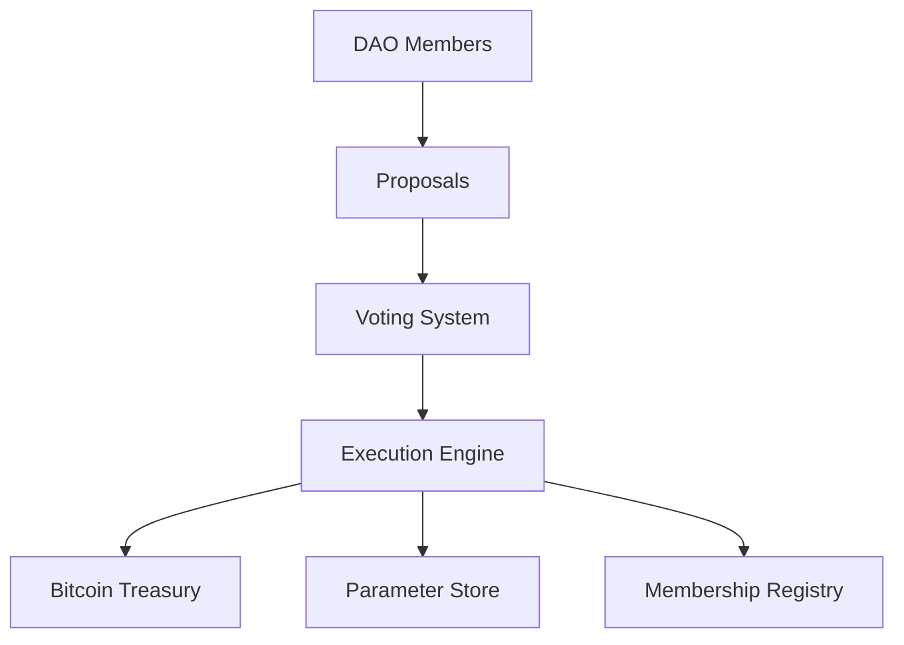

# BitGovern DAO - Bitcoin-Aligned On-Chain Governance Protocol

## Overview

BitGovern DAO is a sophisticated governance protocol enabling decentralized organizations to manage Bitcoin-native assets and operations through Stacks L2 smart contracts. Designed for enterprises and decentralized collectives requiring Bitcoin-aware governance, it combines Bitcoin's security with flexible L2 governance mechanics.

## Key Features

### Bitcoin-Native Governance

- sBTC-integrated BTC treasury management
- Trust-minimized BTC transfers via on-chain proposals
- Bitcoin address validation and UTXO-style accounting

### Hybrid Governance Model

- Token-weighted voting with Sybil resistance
- Configurable time-locked voting periods (1h-60 days)
- Adaptive quorum & majority thresholds
- Proposal spam protection with STX deposits

### Modular Governance Components

1. **BTC Treasury Management**  
   Multi-sig style BTC transfers with sBTC settlement
2. **Parameter Governance**  
   Dynamic adjustment of protocol settings
3. **Membership Management**  
   Decentralized member onboarding/offboarding

## Contract Architecture

### Core Components



### Data Structures

```clarity
;; Proposal structure
{
    creator: principal,
    title: (string-ascii 100),
    description: (string-utf8 1000),
    proposal-type: uint, // 1-3
    created-at-block: uint,
    votes-for: uint,
    votes-against: uint,
    executed: bool
    // Type-specific fields
}

;; Member structure
{
    voting-power: uint,
    joined-at-block: uint
}
```

## Governance Mechanics

### Proposal Lifecycle

1. **Submission**
   - Member stakes proposal fee (1 STX default)
   - Proposal enters pending state
2. **Voting Period**
   - 24 hours default (144 blocks)
   - Members vote with token-weighted power
3. **Execution**
   - Requires quorum (60%+ participation)
   - Requires majority (50%+ approval)
   - Automatic execution post-voting

### Proposal Types

#### 1. BTC Transfers (`PROPOSAL_TYPE_BTC_TRANSFER`)

- **Fields:**
  - Recipient: Bitcoin address (33-byte compressed public key)
  - Amount: Satoshis (≤ treasury balance)
- **Execution:**  
  Triggers sBTC withdrawal to specified BTC address

#### 2. Parameter Changes (`PROPOSAL_TYPE_PARAMETERS_CHANGE`)

- **Adjustable Parameters:**
  ```clarity
  quorum-threshold       // 501-1000 (50.1%-100%)
  majority-threshold     // 1-1000 (0.1%-100%)
  voting-period          // 6-8640 blocks (1h-60d)
  proposal-fee           // 0-1B STX
  max-voting-power       // 1000-1M
  ```
- **Validation:**  
  Strict bounds checking for each parameter type

#### 3. Membership Changes (`PROPOSAL_TYPE_MEMBERSHIP`)

- **Actions:**
  - Add member: Assign voting power (1-10,000)
  - Remove member: Requires non-self proposal
- **Safeguards:**
  - Anti-self-removal checks
  - Voting power cap enforcement

## Security Model

### Key Protections

- **Proposal Validation**
  ```clarity
  assert! (is-valid-btc-address recipient)  // BTC address format check
  assert! (> btc-amount 0)                  // Positive amount
  assert! (<= amount treasury-balance)      // Solvency check
  ```
- **Voting Security**

  - One-vote-per-member enforcement
  - Time-locked execution (min 6 blocks)
  - Quorum bypass prevention

- **Access Control**
  ```clarity
  (define-data-var contract-owner principal tx-sender)
  (asserts! (is-dao-member tx-sender) ERR_UNAUTHORIZED)
  ```

### Error Codes

| Code | Description          |
| ---- | -------------------- |
| u100 | Unauthorized access  |
| u101 | Proposal not found   |
| u102 | Voting period active |
| u107 | Quorum not reached   |
| u110 | Proposal rejected    |

## Usage Guide

### Initialization

```clarity
(initialize-dao
   'SP3FBR2AGK5H9QBDH3EEN6DF8EK8JY7RX8QJ5SVTE  // Initial owner
   'SP3K8BC0PPEVCV7NZ6QSRWPQ2JE9E5B6N3PA0KBR9) // sBTC custodian
```

### Creating Proposals

**BTC Transfer Proposal**

```clarity
(create-btc-transfer-proposal
   "Emergency Treasury Transfer"
   "Transfer 1 BTC to cold storage"
   0x02123456789abcdef0123456789abcdef01234567 // BTC address
   100000000 // 1 BTC in satoshis
)
```

### Voting Mechanics

```clarity
(vote-on-proposal
   42  // Proposal ID
   true // Vote for
)
```

### Execution

```clarity
(execute-proposal 42) // Executes if quorum & majority met
```

## Treasury Management

### Key Functions

```clarity
;; Deposit BTC to treasury (sBTC integration)
(deposit-btc 50000000) // 0.5 BTC

;; Get treasury balance
(get-treasury-balance) // Returns satoshis
```

## Testing & Auditing

### Verification Checklist

1. Parameter boundary validation
2. BTC address format checks
3. Voting power arithmetic accuracy
4. Quorum/majority calculation tests
5. Re-entrancy protection

### Audit Recommendations

- Formal verification for voting math
- sBTC integration testing
- Gas consumption analysis
- Front-running protection assessment
